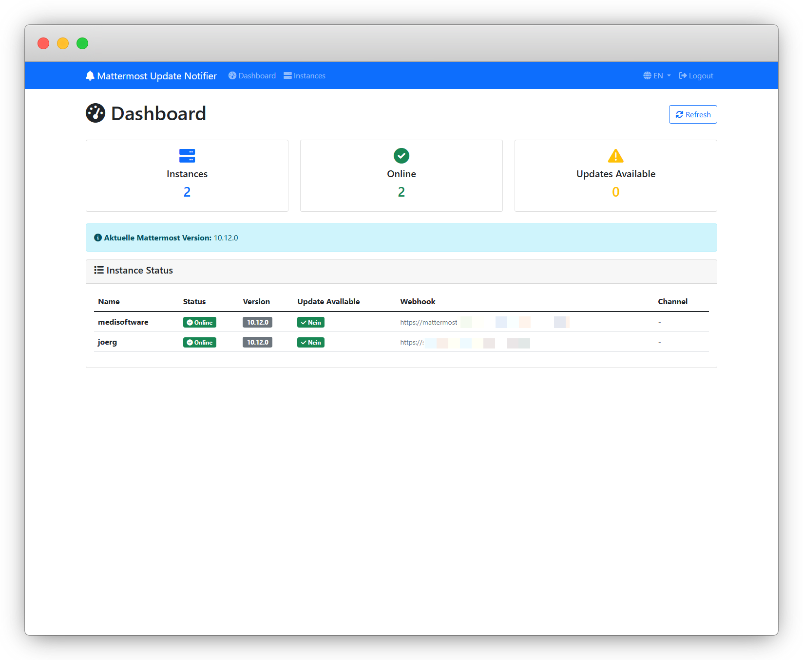
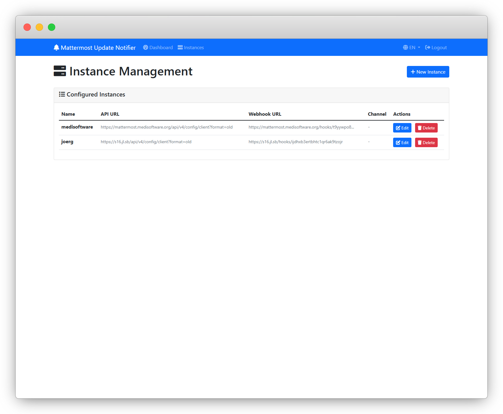
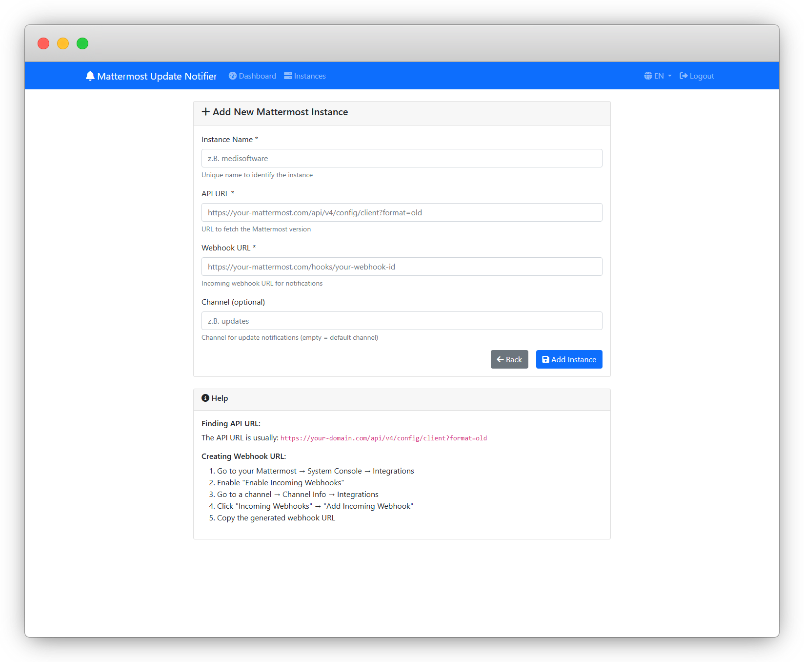

# Mattermost Update Notifier

Ein automatischer Update-Notifier für Mattermost-Instanzen mit Web-Admin-Interface.

**[🇺🇸 English Version](README.md)**

## Features

- 🔄 Automatische Überprüfung auf Mattermost-Updates
- 🌐 Web-Admin-Interface für Instanz-Verwaltung
- 📊 Dashboard mit Status-Übersicht
- 🔐 Passwort-basierte Authentifizierung
- 🐳 Docker-Support mit docker compose
- 📱 Responsive Design
- 🌍 Mehrsprachigkeit (Deutsch/Englisch)

## Screenshots

### Dashboard


### Instanz-Verwaltung


### Neue Instanz hinzufügen


## Installation

### Voraussetzungen

- Docker und Docker Compose
- Mindestens eine Mattermost-Instanz mit API-Zugang
- Incoming Webhook für Benachrichtigungen

### Schnellstart

1. **Repository klonen:**
   ```bash
   git clone <repository-url>
   cd mm_update-notifier
   ```

2. **Konfiguration anpassen:**
   ```bash
   cp config.env.example config.env
   # Bearbeiten Sie config.env mit Ihren Einstellungen
   ```

3. **Services starten:**
   ```bash
   # Nur Web-Interface starten
   docker compose up webapp

   # Oder alle Services (Web-Interface + Update-Checker)
   docker compose --profile checker up
   ```

4. **Web-Interface öffnen:**
   Öffnen Sie http://localhost:5000 in Ihrem Browser

## Konfiguration

### config.env

```bash
# Web Interface Configuration
WEB_PORT=5000
ADMIN_PASSWORD=admin123

# Check Interval (in seconds)
CHECK_INTERVAL=1800
```

### Instanzen hinzufügen

1. Melden Sie sich im Web-Interface an
2. Gehen Sie zu "Instanzen" → "Neue Instanz"
3. Füllen Sie die Felder aus:
   - **Name:** Eindeutiger Name für die Instanz
   - **API URL:** `https://your-domain.com/api/v4/config/client?format=old`
   - **Webhook URL:** Incoming Webhook URL aus Mattermost
   - **Channel:** (Optional) Spezifischer Channel für Benachrichtigungen

### Webhook in Mattermost einrichten

1. Gehen Sie zu Ihrem Mattermost → System Console → Integrations
2. Aktivieren Sie "Enable Incoming Webhooks"
3. Gehen Sie zu einem Channel → Channel Info → Integrations
4. Klicken Sie auf "Incoming Webhooks" → "Add Incoming Webhook"
5. Kopieren Sie die generierte Webhook-URL

## Docker Services

### Web-Interface (Standard)
```bash
docker compose up webapp
```
Startet nur das Web-Admin-Interface.

### Update-Checker
```bash
docker compose --profile checker up
```
Startet sowohl das Web-Interface als auch den automatischen Update-Checker.

## API Endpoints

- `GET /` - Dashboard
- `GET /instances` - Instanz-Verwaltung
- `POST /instances/add` - Neue Instanz hinzufügen
- `POST /instances/delete/<id>` - Instanz löschen
- `GET /api/status` - JSON-Status aller Instanzen

## Entwicklung

### Lokale Entwicklung

1. **Virtual Environment erstellen:**
   ```bash
   python -m venv .venv
   source .venv/bin/activate  # Linux/Mac
   .venv\Scripts\activate     # Windows
   ```

2. **Dependencies installieren:**
   ```bash
   pip install -r requirements.txt
   ```

3. **Services starten:**
   ```bash
   # Web-Interface
   python webapp.py

   # Update-Checker
   python main.py
   ```

### Projekt-Struktur

```
mm_update-notifier/
├── main.py              # Update-Checker Script
├── webapp.py            # Flask Web-Interface
├── requirements.txt     # Python Dependencies
├── config.env          # Konfiguration
├── docker compose.yml  # Docker Services
├── Dockerfile          # Docker Image
├── data/               # Datenverzeichnis
│   ├── instances.json  # Instanz-Konfiguration
│   └── lastnotifiedversion*.txt
└── templates/          # HTML Templates
    ├── base.html
    ├── login.html
    ├── dashboard.html
    ├── instances.html
    └── add_instance.html
```

## Troubleshooting

### Häufige Probleme

1. **"API ist nicht erreichbar"**
   - Überprüfen Sie die API-URL
   - Stellen Sie sicher, dass die Mattermost-Instanz erreichbar ist

2. **"Version field not found in API response"**
   - Überprüfen Sie, ob die API-URL korrekt ist
   - Stellen Sie sicher, dass `?format=old` Parameter enthalten ist

3. **Webhook-Fehler**
   - Überprüfen Sie die Webhook-URL
   - Stellen Sie sicher, dass Incoming Webhooks aktiviert sind

### Logs anzeigen

```bash
# Docker Logs
docker compose logs -f webapp
docker compose logs -f update-checker

# Lokale Logs
# Logs werden in der Konsole angezeigt
```

## Sicherheit

- Ändern Sie das Standard-Passwort in `config.env`
- Verwenden Sie HTTPS in der Produktion
- Beschränken Sie den Netzwerk-Zugang auf das Web-Interface
- Regelmäßige Updates der Dependencies

## Lizenz

Dieses Projekt steht unter der MIT-Lizenz - siehe die [LICENSE](LICENSE) Datei für Details.

## Support

Bei Problemen oder Fragen erstellen Sie ein Issue im Repository.
